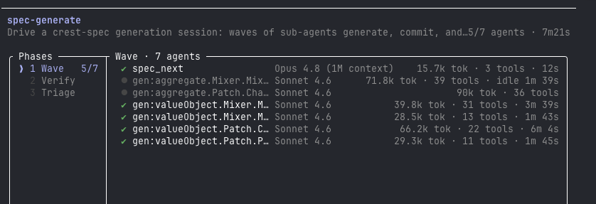
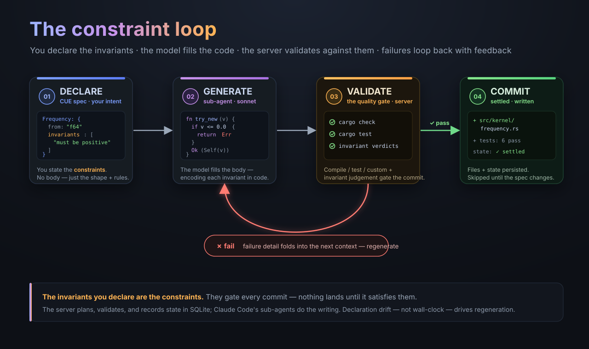

# crest-spec



<sub>Claude Code's `/workflows` view during a live `spec-generate` run. The workflow orchestrates a wave of sub-agents that fill in each resource (value objects, aggregates) in parallel — each pulling its scoped prompt, generating, and committing — followed by Verify and Triage phases. This is the declare → coordinate → fill → check loop below, as seen from inside the session.</sub>

crest-spec is a declarative code-generation engine for developers who model software as a domain: you declare your architecture as [CUE](https://cuelang.org) using DDD vocabulary — bounded contexts, aggregates, value objects, ports, adapters — and your agent host drives an LLM to fill in the implementation, one resource at a time, against the invariants you stated.

You write the *declaration*; crest-spec coordinates the *fill*. State lives in SQLite, so the engine plans what changed, generates only what's needed, and leaves settled resources alone — a plan/apply lifecycle for code, not infrastructure.

## The declare → fill loop

A mixer channel strip in the reference fixture, declared as an aggregate — state, commands, events, and two prose invariants (`fixtures/crest-synth/spec/mixer.cue`):

```cue
project: contexts: Mixer: aggregates: ChannelStrip: {
	root:    true
	purpose: "one patch's channel: input gain, insert chain, volume, pan, mute/solo, and up to 8 send taps"
	state: {inputGain: "Amplitude", volumeDb: "Decibel", pan: "Pan", mute: "bool", solo: "bool", sends: "list<SendTap>", peak: "PeakLevel"}
	commands: {
		SetVolume: {volumeDb: "Decibel"}
		SetPan: {pan: "Pan"}
		SetMute: {mute: "bool"}
		SetSolo: {solo: "bool"}
		SetSend: {index: "u8", tap: "SendTap"}
	}
	events: {
		LevelChanged: {volumeDb: "Decibel"}
		SoloChanged: {solo: "bool"}
	}
	invariants: [
		"a strip has at most 8 send taps",
		"peak metering reflects the level after volume and pan are applied",
	]
}
```

That's the whole declaration. No body. The loop turns it into `src/mixer/channel_strip.rs`, where each invariant becomes a typed guard:

```rust
ChannelStripCommand::SetSend { index, tap } => {
    let slot = usize::from(index);
    if slot >= MAX_SENDS {
        return Err(ChannelStripError::SendIndexOutOfRange { index });
    }
    self.sends[slot] = Some(tap);
    Ok(Vec::new())
}
```

```rust
/// Per invariant, peak metering reflects the level *after* volume and
/// pan are applied — never the raw input.
pub fn meter(&mut self, input: Amplitude) -> PeakLevel {
    let post_volume = input.value() * self.volume_db.to_linear();
    let (left_gain, right_gain) = self.pan.equal_power_gains();
    let left = post_volume * left_gain;
    let right = post_volume * right_gain;
    let peak = left.abs().max(right.abs());
    self.peak = PeakLevel::from_clamped(peak);
    self.peak
}
```

…and a named test that proves it:

```rust
#[test]
fn strip_never_exceeds_eight_send_taps() {
    let mut strip = ChannelStrip::new();
    for i in 0..MAX_SENDS as u8 {
        let tap = SendTap::new(SendBusId(i), Amplitude::unity());
        strip
            .handle(ChannelStripCommand::SetSend { index: i, tap })
            .unwrap();
    }
    assert_eq!(strip.sends().count(), MAX_SENDS);

    let overflow_tap = SendTap::new(SendBusId(9), Amplitude::unity());
    let result = strip.handle(ChannelStripCommand::SetSend {
        index: MAX_SENDS as u8,
        tap: overflow_tap,
    });
    assert!(result.is_err());
    assert_eq!(strip.sends().count(), MAX_SENDS);
}
```

The state types (`Amplitude`, `Decibel`, `Pan`, `PeakLevel`) are themselves declared value objects, each generated as a newtype with a validating constructor — the domain vocabulary in `state:` becomes the type system. The declaration is the source of truth; the body is regenerated whenever the declaration changes.

### Ports and adapters

A port declares a contract in language-neutral types; an adapter names the implementation and pins its framework in `meta` — the only place a crate name appears (`fixtures/crest-synth/spec/realtime.cue`):

```cue
project: contexts: RealTime: ports: EventRing: {
	contract: {
		push: "(message: BoundaryMessage) -> result<(), RingFull>"
		pop:  "() -> option<BoundaryMessage>"
	}
	meta: notes: "single producer (UI/MIDI thread), single consumer (audio thread)"
}

project: adapters: RtrbEventRing: {
	implements: "port.RealTime.EventRing"
	layer:      "infrastructure"
	meta: framework: "rtrb"
}
```

The generated adapter implements exactly that surface on the `rtrb` ring buffer — and the SPSC note in `meta.notes` became a documented safety argument for the lock-free boundary in the generated code.

### Same engine, any language

The engine is language-agnostic; `meta.language` and your validation commands decide the target. crest-ci — a high-availability, GitHub-Actions-compatible CI control plane — is generated as an Elixir/OTP umbrella from the same kind of spec. One declaration line with an actor-scoped invariant:

```cue
RunnerJobPhase: {from: "enum", description: "Queued, Leased, Acquired, Completed, Abandoned", invariants: [
	"legal transitions are exactly Queued->Leased, Leased->Acquired, Leased->Queued (lease expiry before ack, controller-only), Acquired->Completed, and {Leased,Acquired}->Abandoned (controller-only)",
]}
```

…becomes a data-driven transition table where the "controller-only" parenthetical is baked in as actor authorization, not left to callers:

```elixir
# {from, to} => set of actors permitted to perform the transition.
@transitions %{
  {:queued, :leased} => :any,
  {:leased, :acquired} => :any,
  {:leased, :queued} => [:controller],
  {:acquired, :completed} => :any,
  {:leased, :abandoned} => [:controller],
  {:acquired, :abandoned} => [:controller]
}

def legal_transition?(from, to, actor)
    when from in @values and to in @values and actor in [:controller, :gateway] do
  case Map.fetch(@transitions, {from, to}) do
    {:ok, :any} -> true
    {:ok, allowed} when is_list(allowed) -> actor in allowed
    :error -> false
  end
end
```

## What it is

crest-spec runs as an **MCP server that is a pure spec state engine**. It plans, tracks resource state in SQLite, runs mechanical validations (compile / test / custom / integration) at commit time, and records history. It never calls an LLM, never spawns sub-agents, and never interprets a natural-language task.

**Your agent host is the orchestrator.** Claude Code is the reference host (via the bundled `spec-generate` skill/workflow); OpenCode is supported via `crest-spec init`; any agentic CLI with an MCP client and native sub-agent dispatch can drive it — see [docs/AGENT_INTEGRATION.md](docs/AGENT_INTEGRATION.md) for the contract. The host spawns one sub-agent per resource per wave; each fetches its scoped prompt, writes code, and commits through the server's validation gate. The server is the quality gate; the host does the writing — and never grades its own work: mechanical validations gate the commit, independent falsification-gated behavioral checks gate the wave, and `spec/finish` refuses to seal a session while any check is unresolved.

## Proven on real projects

Two full systems have been generated end-to-end from CUE specs, in different languages:

| | **crest-synth** | **crest-ci** |
|---|---|---|
| Domain | polyphonic software synthesizer (VA/wavetable/sample/FM engines, mixing console, modulation, MIDI playback, GUI) | HA GitHub-Actions-compatible CI control plane (Kubernetes CRs as the only store, leader-elected controller, stateless gateways) |
| Language | Rust | Elixir / OTP umbrella |
| Spec | 1,674 lines of CUE, 152 resources, 10+ contexts | 1,014 lines of CUE, 80 resources, 7 contexts |
| Generated | 45,312 lines across 164 files | ~31,600 lines across 94 modules + 95 test files |
| Proof | 1,268 tests; 118/118 behavioral checks graduated; 13 demo binaries that assert measured values; 8 rendered `.wav` artifacts; a windowed autopilot run asserting audio peak > 0 and producing a screenshot | 838 tests; chaos test that kills the leader mid-flight and measures failover; StreamData property test proving single-winner CAS arbitration; 60+ vector GitHub-expression conformance table; byte-identical-plan determinism test |

That's roughly a **27–31× amplification** from declaration to verified implementation. Proof in these projects is *measured*, not printed: demo binaries assert `steals > 0`, chaos tests assert `duplicate_children=0`, and the commit gate parses those lines with `stdout_contains` / `exit_code` / `file_exists` assertions declared in the spec.

## Prerequisites

- **Go 1.26+**
- **An agent host** — [Claude Code](https://docs.anthropic.com/en/docs/claude-code/overview) (reference) or [OpenCode](https://opencode.ai)

## Install

```bash
go install github.com/crestenstclair/crest-spec/cmd/crest-spec@latest
```

Or from a checkout:

```bash
git clone https://github.com/crestenstclair/crest-spec.git
cd crest-spec
make build        # binary lands in bin/crest-spec
make install      # go install ./cmd/crest-spec
```

## Quickstart

```bash
# 1. A project directory with a CUE spec
mkdir my-project && cd my-project && mkdir spec
cat > spec/project.cue << 'EOF'
package spec
project: {
	name: "my-project"
	meta: {language: "go", style: "idiomatic Go, DDD"}
	contexts: Core: {
		purpose: "user lifecycle"
		aggregates: User: {
			root: true
			purpose: "manages a user"
			state: {id: "string", name: "string", email: "string"}
			invariants: ["email must be well-formed and unique per user id"]
		}
	}
}
EOF

# 2. Bootstrap your agent host's integration files
crest-spec init                      # interactive: OpenCode, Claude Code, or both
crest-spec init --agent claude-code  # writes .mcp.json pointing at this binary
crest-spec init --agent opencode     # writes opencode.json + orchestrator/generator/
                                     # triage/verifier/design/tasks agents + /apply-crest-spec

# 3. Open your host — crest-spec auto-connects over stdio MCP
claude        # or: opencode

# 4. Ask it to run the spec:
#    Claude Code: "run the spec" (the spec-generate skill drives the loop)
#    OpenCode:    /apply-crest-spec
```

For Claude Code, the `spec-generate` skill and workflow ship in this repo under `.claude/` — copy them into your project's `.claude/skills/` and `.claude/workflows/` (or run from a checkout).

## How it works



A plan/apply lifecycle: the **server** plans and checks; the **host** fills.

1. **Declare** — Write your domain as CUE in the spec directory: contexts, aggregates, value objects, domain/application services, repositories, ports, adapters, and assets. Each is a *resource*.
2. **Coordinate** (`spec/plan`, `spec/begin`) — The server diffs the CUE spec against SQLite state by declaration hash, computes a dependency graph, and returns an execution plan ordered into waves, plus any pending destroys for removed resources. Destroys never auto-execute — `spec/confirm_destroys` is human-gated.
3. **Fill** (`spec/next` → `spec/context` → `spec/commit`) — For each resource in a wave, `spec/context` creates an immutable attempt and selects a budgeted, goal-directed prompt: target goals and acceptance, the task and resource contract, dependencies, consumers, relevant code, design constraints, and retry evidence. Included, truncated, and omitted sources—and the exact bytes served—are stored in SQLite before dispatch. The sub-agent authors the files and commits.
4. **Check** — On `spec/commit` the server writes the files and runs the resource's declared validations, fail-closed (a validation that cannot launch is a failure). Independent verifier agents then prove behavior via falsification-gated checks (`spec/verify`, below). Any failure rejects/regenerates with the detail folded into the next `spec/context`, up to `CREST_SPEC_MAX_RETRIES`. Persistent failures are triaged with `spec/resolve`, or `spec/skip` when the spec itself is provably contradictory.
5. **Finish** (`spec/finish`) — Waves run until none remain. Finish refuses while behavioral checks are unresolved (`force` is an explicit human decision). Optionally a reflection pass distils cross-session learnings via `spec/record_learnings` — real examples from crest-ci include "schedule manifest assets before whole-tree gates" (auto-applied 32×) and "verify the file ledger before integration gates."

Settled resources whose declaration hash is unchanged are skipped — regeneration is driven by spec changes, not wall-clock. Structural changes (types, contracts, invariants) cascade to dependents; guidance changes (prompts, descriptions) regenerate only the edited resource. Retries and modifications run in **UPDATE mode**: the existing files are served back with the failure, and the generator makes the minimal edit — a blank-slate rewrite happens only for brand-new resources. Generated files can be **co-owned** by multiple resources (a shared module survives when one of its owners is destroyed), and destroying a resource cascades its behavioral tasks and checks with it.

Context observability is canonical state, not a sidecar: content-addressed snapshots, attempt ancestry, budgets, selection reasons, omissions, template hashes, and rendered prompts live in the existing SQLite database. The dashboard's **Contexts** tab reads those records directly and can compare a failed attempt with its retry even after the working tree changes. Existing databases migrate additively; older generation history remains visible as legacy history without fabricated context manifests.

Once generated, a file's content is yours: the planner guides architecture and invariants, it does not police file contents.


<sub>The same loop in full, end to end: the **server** (pure state engine) loads and diffs the CUE spec to plan waves; the **host**'s sub-agents fill each resource; the server's **commit gate** validates and either persists the result or rejects it, folding the failure back across the MCP boundary into the next `spec/context`.</sub>

## Behavioral verification: the falsification gate

Mechanical validations prove the code compiles and its tests pass. Behavioral checks prove the *behavior the spec asked for* exists — and that the check itself isn't theater.

Before generation, design agents commit each bounded context's observable contract (`spec/design_commit`), and task agents decompose it into per-resource checks with **typed predicates** (`spec/tasks_commit` — prose predicates, expression-syntax field names, and missing bounds are rejected at authoring time). A real check from crest-synth's voice allocator:

```json
{
  "behavior": "at capacity, StealPolicy Refuse declines the allocation: no voice is returned and the pool's voice count stays at maxPolyphony",
  "predicates": [
    {"field": "VoiceAllocator.allocate(...).isSome when stealPolicy=Refuse and the pool already holds maxPolyphony=4 voices", "op": "eq", "value": 0},
    {"field": "count(voices in pool) after allocate(...) with stealPolicy=Refuse on a full pool", "op": "eq", "value": 4}
  ]
}
```

To pass a check, an independent verifier sub-agent (which never reads the implementation under test) must submit **two** observations to `spec/verify`: one from a **real witness** exercising the committed code, and one from a **degenerate stub**. The check passes only if the witness satisfies the predicates *and* the stub fails them — a check a stub can pass proves nothing and is recorded as theater. Only a verified pass can `spec/graduate`, and `spec/finish` refuses while any check is pending, failed, theater, or malformed.

## MCP tool surface

Grouped by who calls what — "orchestrator" is the host's top-level loop; "sub-agent" is a host-native agent spawned for one resource or check. Full detail in [docs/AGENT_INTEGRATION.md](docs/AGENT_INTEGRATION.md).

**Authoring & inspection** (orchestrator)

| Tool | Purpose |
|------|---------|
| `spec/validate` | Parse + registry-check the spec; run after every spec edit |
| `spec/plan` | Diff spec vs state → create/modify/destroy actions + waves |
| `spec/inspect` | One resource's full declaration (interface, invariants, prompts) |
| `spec/context_attempts`, `spec/context_inspect`, `spec/context_compare` | List, reconstruct, and structurally compare immutable generation contexts |
| `spec/graph`, `spec/state`, `spec/status`, `spec/diff`, `spec/history`, `spec/log` | Read-only views of the graph/session/db |
| `spec/sql` | Read-only SQL over the whole state db — the escape hatch |

**Session lifecycle** (orchestrator)

| Tool | Purpose |
|------|---------|
| `spec/begin` | Start a session; returns plan, waves, pending destroys |
| `spec/confirm_destroys` | Explicit human-gated deletion for removed resources |
| `spec/next` | Next dependency-ordered wave; `done:true` ends the loop |
| `spec/resolve` | Attach triage guidance to a failed resource and reset it |
| `spec/skip` | Skip a resource — requires quoting the spec contradiction |
| `spec/verify_wave`, `spec/wave_status` | Whole-tree validation gate between waves |
| `spec/finish` | Finalize; fail-closed while behavioral checks are unresolved |
| `spec/unlock` | Break a stale lock after a crash |

**Generation** (called by generator sub-agents)

| Tool | Purpose |
|------|---------|
| `spec/context` | Create an immutable attempt and return budgeted goal/acceptance/task/contracts/code context plus selection decisions and rendered prompts |
| `spec/commit` | Submit candidate files; the engine runs the declared validations and accepts or rejects |
| `spec/note` | Attach a note to the session/resource (surfaces in later context) |

**Behavioral verification** (called by design/task/verifier sub-agents)

| Tool | Purpose |
|------|---------|
| `spec/design_commit` | Commit a bounded context's observable contract |
| `spec/tasks_commit` | Commit per-resource tasks/checks; structurally validated at authoring time |
| `spec/verify` | Submit real-witness + degenerate-stub observations for one check |
| `spec/graduate` | Promote a check — only after a real verified pass |

**Spec evolution & setup** (orchestrator): `spec/amend`, `spec/list_amendments`, `spec/apply_amendments`, `spec/graduate_amendment` (a ledger of spec-resident corrections), `spec/record_learnings`, `spec/learnings`, `spec/promote_learnings` (cross-session lessons folded into future prompts), and `spec/bootstrap`, `spec/import`, `spec/evolve`, `spec/mode`, `spec/prompt`, `spec/vacuum`.

## Host integration

crest-spec is host-agnostic by contract: the engine never dispatches agents, so any host with an MCP client (or plain HTTP) and native sub-agent dispatch can drive it.

- **[docs/AGENT_INTEGRATION.md](docs/AGENT_INTEGRATION.md)** — the full engine ↔ host contract: division of responsibilities, the canonical orchestration loop, the rules (iterate don't regenerate, halts are loud, destroys are human-gated, sub-agents return data not vibes), and the observed anti-patterns.
- **[docs/hosts/claude-code.md](docs/hosts/claude-code.md)** — the reference adapter: `.mcp.json` + the `spec-generate` skill/workflow.
- **[docs/hosts/opencode.md](docs/hosts/opencode.md)** — the OpenCode adapter: MCP config, orchestrator/generator/triage/verifier/design/tasks subagents with `permission.task` enforcement, and the `/apply-crest-spec` command.

`crest-spec init` writes these integration files for you (interactively, or with `--agent opencode|claude-code|both`; `--force` overwrites).

**HTTP transport** — set `CREST_SPEC_HTTP_ADDR` and the same tools are served as JSON-RPC over `POST /mcp`. This is the practical choice for fan-out: worker sub-agents only need `curl`, no MCP client. crest-synth's generation was driven end-to-end this way by workflow scripts (`spec-generate-http.js`, `spec-behavioral-http.js`, `spec-reauthor-http.js`, `spec-verify-pending-http.js`).

## Scope

crest-spec deliberately does **not**:

- **Call an LLM or spawn subprocesses.** The server is a state engine. All generation is driven by your host's own sub-agents — there are no `run_prompt` / `dispatch` tools, and no `spec/apply` / `spec/run_wave`. The one exception: `spec/commit` runs the *validation commands declared in your spec* against the candidate files — deterministic commands, not agents.
- **Generate from prose.** Resources are declared in CUE with DDD structure (contexts, aggregates, value objects, ports…), not free-form feature descriptions.
- **Pin a language or framework.** `meta.language`, your validation commands, and the asset kinds in your spec decide the target. crest-synth is Rust; crest-ci is Elixir/OTP; the e2e spec targets Go.
- **Judge correctness on your behalf.** It runs the mechanical validations *you* declare and mechanically enforces the behavioral falsification gate. It never grades semantics itself — and neither does the generator: there are no self-judged verdicts anywhere in the loop.
- **Start from scratch when code exists.** Regeneration runs in UPDATE mode — existing files served back with the failure or the changed requirement, minimal edit expected. Iteration is the default.
- **Police file contents.** The goal is architecture, design, and invariants. Formatting is auto-normalized, never a retry loop; drift detection is advisory, never a defect.

## Configuration

All configuration is via environment variables prefixed with `CREST_SPEC_`, set under the `env` key of your host's MCP config (or exported in your shell):

| Variable | Default | Purpose |
|----------|---------|---------|
| `CREST_SPEC_SPEC_DIR` | `./spec` | Path to the CUE spec directory |
| `CREST_SPEC_GENERATE_MODEL` | `claude-sonnet-5` | Model **label** recorded in state and mixed into effective hashes (the server never invokes it) — keep it stable per project; changing it re-plans everything |
| `CREST_SPEC_MAX_RETRIES` | `3` | Per-resource retry budget for the commit/retry loop |
| `CREST_SPEC_WAVE_MAX_RETRIES` | `2` | Max retries for wave-level verification |
| `CREST_SPEC_TYPE_CHECK_CMD` | *(none)* | Custom type-check command (e.g. `cargo check`) |
| `CREST_SPEC_TEST_CMD` | *(none)* | Custom test command (e.g. `go test ./...`) |
| `CREST_SPEC_MODE` | `default` | Mode label folded into hashes (different modes regenerate) |
| `CREST_SPEC_EVOLVE` | `all` | When to emit reflection prompts (`finish` / `all`) |
| `CREST_SPEC_HTTP_ADDR` | *(none)* | Enable Streamable HTTP transport (e.g. `127.0.0.1:8792`) |

Run one server per project directory; the SQLite db lives in `.crest-spec/`.

## CLI

With no arguments, `crest-spec` starts the MCP server on stdio. Generation is never started from the CLI — the subcommands are setup and maintenance:

```
crest-spec init [--agent name] [--force]  bootstrap agent-host integration files
crest-spec dashboard [--addr :8080]       web dashboard for monitoring sessions
crest-spec adopt                          seed baseline state from on-disk code
crest-spec context list [limit]           list immutable context attempts
crest-spec context show <manifest|attempt> reconstruct exact served context
crest-spec context compare <left> <right> compare source and selection changes
crest-spec state list                     print all resources in state
crest-spec state rm <resourceId>          remove a resource from state
crest-spec diff <apply_a> <apply_b>       show changes between two applies
crest-spec vacuum --before <date>         compact history older than date
crest-spec sql <query>                    read-only SQL query against state
crest-spec --help                         full usage and env-var reference
```

## Development

```bash
make test         # go test ./...
make build        # build to bin/crest-spec
make fmt          # go fmt ./...
make lint         # golangci-lint run
```

See [SPEC.md](SPEC.md) for the full functional and implementation specification, and `fixtures/crest-synth` for the reference spec. Its `spec/` directory is the whole-picture design (domain-grouped, one file per bounded context); `phases/phase-1/` through `phases/phase-11/` are the original phased spec hydrated into standalone directories — each holds `base.cue`, the cumulative phase files, and the resolved winning overrides for that stage. Point `CREST_SPEC_SPEC_DIR` at any phase to replay that stage of the evolving design, then at the next one and the planner regenerates exactly the delta.

## Status

Pre-1.0 and under active development. The architecture — server as pure state engine, host sub-agents doing generation — is validated end-to-end on two real multi-session projects (crest-synth in Rust, crest-ci in Elixir), but the MCP tool surface, CUE schema, and configuration are not yet stable and may change without notice between commits. There is no compatibility guarantee on the SQLite state schema; expect to regenerate from spec. Use it on projects you can afford to re-run.
