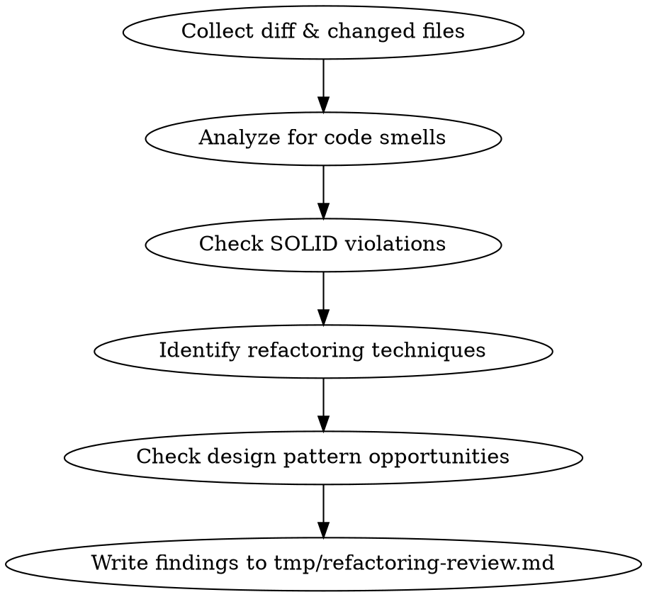

# Refactoring Reviewer

## Overview

Reviews code changes for refactoring opportunities, coding standards, and structural improvements **without changing behavior**. Focuses on code structure, naming, function granularity, SOLID principles, design patterns, and code smells from the refactoring.guru catalog.

## When to Use

- Reviewing a PR or branch diff for code quality
- Post-implementation review before merging
- User asks to "review", "clean up", or "refactor" code
- Checking adherence to SOLID principles

**When NOT to use:** When the goal is to change behavior or add features. This skill is for structural improvements only.

## Review Process



### Phase 1: Collect Changed Files and Diff

```bash
# Get current branch
current_branch=$(git branch --show-current)

# Get base branch from PR or fall back to main
pr_number=$(gh pr list --head "$current_branch" --json number --jq '.[0].number' 2>/dev/null)
if [ -n "$pr_number" ]; then
    base_branch=$(gh pr view "$pr_number" --json baseRefName --jq '.baseRefName')
else
    base_branch="main"
fi

# Get changed files and diff
changed_files=$(git diff --name-only ${base_branch}...HEAD)
git_diff=$(git diff ${base_branch}...HEAD)
```

### Phase 2: Analyze Code Changes

Review the diff and changed files against all focus areas below.

### Phase 3: Generate Findings

Write findings to `./tmp/refactoring-review.md` with this structure:

```markdown
# Refactoring Review: [branch-name]

**Date:** YYYY-MM-DD
**Base branch:** [base]
**Files reviewed:** [count]

## Critical Issues
[Issues that should block merge]

## Refactoring Opportunities
[Improvements worth making now]

## Minor Suggestions
[Nice-to-haves, style nits]

## Summary
[One paragraph overall assessment]
```

## Code Smells Catalog

Reference: [refactoring.guru/refactoring/smells](https://refactoring.guru/refactoring/smells)

### Bloaters (code that grows excessively)

| Smell | Symptom |
|-------|---------|
| **Long Method** | Method too large to understand at a glance |
| **Large Class** | Class doing too much, too many fields/methods |
| **Primitive Obsession** | Using primitives instead of small value objects |
| **Long Parameter List** | More than 3-4 parameters |
| **Data Clumps** | Groups of variables always used together |

### Object-Orientation Abusers

| Smell | Symptom |
|-------|---------|
| **Switch Statements** | Conditional logic based on type codes |
| **Temporary Field** | Fields only sometimes populated |
| **Refused Bequest** | Subclass ignoring inherited members |
| **Alternative Classes with Different Interfaces** | Same behavior, different API |

### Change Preventers

| Smell | Symptom |
|-------|---------|
| **Divergent Change** | One class modified for unrelated reasons |
| **Shotgun Surgery** | One change touches many classes |
| **Parallel Inheritance Hierarchies** | Subclassing requires parallel hierarchy |

### Dispensables

| Smell | Symptom |
|-------|---------|
| **Duplicate Code** | Identical/similar code in multiple places |
| **Lazy Class** | Class that doesn't justify its existence |
| **Data Class** | Class with only getters/setters, no behavior |
| **Dead Code** | Unreachable or unused code |
| **Speculative Generality** | Unused abstractions "just in case" |
| **Excessive Comments** | Comments compensating for unclear code |

### Couplers

| Smell | Symptom |
|-------|---------|
| **Feature Envy** | Method uses another object's data more than its own |
| **Inappropriate Intimacy** | Classes overly dependent on each other's internals |
| **Message Chains** | Long chains: `a.getB().getC().getD()` |
| **Middle Man** | Class that only delegates without adding value |

## Refactoring Techniques Quick Reference

Reference: [refactoring.guru/refactoring/techniques](https://refactoring.guru/refactoring/techniques)

### Composing Methods

| Technique | When to Apply |
|-----------|---------------|
| **Extract Method** | Long method, code needing comments to explain |
| **Inline Method** | Method body is as clear as its name |
| **Extract Variable** | Complex expression that needs a name |
| **Replace Temp with Query** | Temp used in multiple places, could be method |
| **Split Temporary Variable** | One temp assigned multiple times for different purposes |
| **Replace Method with Method Object** | Long method with local variables preventing extraction |
| **Substitute Algorithm** | Simpler algorithm achieves same result |

### Moving Features Between Objects

| Technique | When to Apply |
|-----------|---------------|
| **Move Method/Field** | Method/field used more by another class |
| **Extract Class** | Class doing work of two |
| **Inline Class** | Class doing almost nothing |
| **Hide Delegate** | Client calls through chain of objects |
| **Remove Middle Man** | Class has too many delegating methods |

### Organizing Data

| Technique | When to Apply |
|-----------|---------------|
| **Replace Magic Number with Constant** | Literal numbers scattered through code |
| **Encapsulate Field** | Public field should be accessed via methods |
| **Encapsulate Collection** | Getter returns raw collection |
| **Replace Type Code with Subclasses** | Type code affects behavior |
| **Replace Type Code with State/Strategy** | Type code changes at runtime |

### Simplifying Conditionals

| Technique | When to Apply |
|-----------|---------------|
| **Decompose Conditional** | Complex condition with large if/else blocks |
| **Consolidate Conditional Expression** | Multiple conditions yield same result |
| **Replace Nested Conditional with Guard Clauses** | Deep nesting obscures normal path |
| **Replace Conditional with Polymorphism** | Switch/if-else on type |
| **Introduce Null Object** | Repeated null checks for same object |

### Simplifying Method Calls

| Technique | When to Apply |
|-----------|---------------|
| **Rename Method** | Name doesn't reveal intent |
| **Separate Query from Modifier** | Method both returns value and changes state |
| **Parameterize Method** | Multiple methods do similar things |
| **Introduce Parameter Object** | Several params always travel together |
| **Replace Constructor with Factory Method** | Constructor logic is complex or needs polymorphism |

### Dealing with Generalization

| Technique | When to Apply |
|-----------|---------------|
| **Pull Up Method/Field** | Duplicated across subclasses |
| **Push Down Method/Field** | Used by only one subclass |
| **Extract Subclass/Superclass/Interface** | Subset of features or common behavior |
| **Collapse Hierarchy** | Subclass barely differs from parent |
| **Replace Inheritance with Delegation** | Subclass uses only a fraction of superclass |

## When to Refactor

Reference: [refactoring.guru/refactoring/when](https://refactoring.guru/refactoring/when)

- **Rule of Three:** First time, just do it. Second time, wince but repeat. Third time, refactor.
- **When adding a feature:** Clean up surrounding code first — easier to add to clean code.
- **When fixing a bug:** Bugs hide in messy code. Clean it and errors surface.
- **During code review:** Last chance to tidy before merge.

## Design Patterns Quick Reference

Reference: [refactoring.guru/design-patterns](https://refactoring.guru/design-patterns)

When reviewing, check whether code would benefit from (or is misusing) these patterns:

### Creational Patterns

| Pattern | Problem It Solves |
|---------|-------------------|
| **Factory Method** | Subclasses need to decide which concrete type to create |
| **Abstract Factory** | Need families of related objects without specifying concrete classes |
| **Builder** | Complex object needs step-by-step construction |
| **Prototype** | Creating objects by cloning is cheaper than building from scratch |
| **Singleton** | Exactly one instance needed with global access (use sparingly) |

### Structural Patterns

| Pattern | Problem It Solves |
|---------|-------------------|
| **Adapter** | Incompatible interface needs to work with existing code |
| **Bridge** | Abstraction and implementation should vary independently |
| **Composite** | Tree structures where individual and composite objects are treated uniformly |
| **Decorator** | Add responsibilities dynamically without subclassing |
| **Facade** | Simplify access to a complex subsystem |
| **Flyweight** | Many similar objects consuming too much memory |
| **Proxy** | Control access, add lazy loading, or logging to another object |

### Behavioral Patterns

| Pattern | Problem It Solves |
|---------|-------------------|
| **Chain of Responsibility** | Multiple handlers, unknown which should process a request |
| **Command** | Encapsulate requests as objects for queuing, undo, logging |
| **Iterator** | Traverse a collection without exposing internals |
| **Mediator** | Reduce chaotic dependencies between many objects |
| **Memento** | Save/restore object state without exposing internals |
| **Observer** | One-to-many notification when state changes |
| **State** | Object behavior changes based on internal state |
| **Strategy** | Swap algorithms at runtime |
| **Template Method** | Define algorithm skeleton, let subclasses override steps |
| **Visitor** | Add operations to objects without modifying their classes |

## SOLID Principles Checklist

| Principle | What to Look For |
|-----------|-----------------|
| **SRP** | Class has multiple reasons to change; mixed concerns |
| **OCP** | Adding new behavior requires modifying existing code |
| **LSP** | Subtype can't be used where base type is expected |
| **ISP** | Implementor forced to stub methods it doesn't need |
| **DIP** | High-level module depends on concrete class, not abstraction |

## Clean Code Checklist

- **Naming:** Meaningful, pronounceable, searchable. Same concept = same name everywhere.
- **Functions:** Small, do one thing, few arguments, no side effects.
- **Comments:** Only what the code cannot say. Remove comments that restate the code.
- **Dead code:** Remove unused variables, functions, imports, commented-out blocks.
- **Typos:** Check variable names, comments, strings for spelling errors.
- **Boundaries:** Clear interfaces between modules. No leaking abstractions.
- **Testability:** Code structure facilitates testing without requiring major refactoring.

## Common Mistakes in Reviews

| Mistake | Correction |
|---------|------------|
| Flagging every pattern absence | Only suggest patterns that solve an actual problem in the code |
| Suggesting refactoring that changes behavior | Refactoring preserves behavior — if it changes behavior, it's a feature change |
| Over-abstracting simple code | Three similar lines are better than a premature abstraction |
| Ignoring the "Rule of Three" | Don't refactor on first or second occurrence |
| Reviewing style instead of structure | Focus on smells and principles, not formatting preferences |
