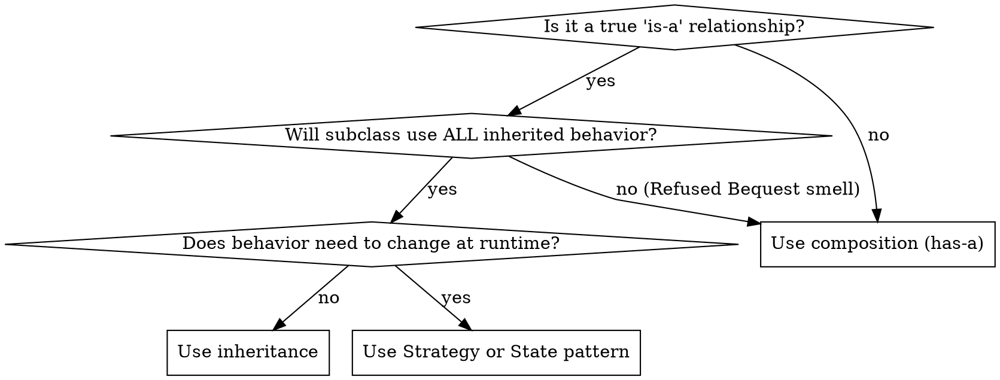

# Writing Clean Code

## Overview

Guide for writing code that is obvious to other programmers, contains no duplication, has minimal complexity, and is testable. Applies SOLID principles, clean code practices, and design patterns as a default writing discipline — not as an afterthought.

## When to Use

- Writing new classes, methods, or features
- Structuring a new module or subsystem
- Deciding how objects should relate to each other
- Choosing between inheritance, composition, or delegation

**When NOT to use:** Reviewing existing code (use `refactoring-reviewer` instead).

## The Five Qualities of Clean Code

1. **Obvious to other programmers** — clear naming, no magic numbers, no hidden side effects
2. **No duplication** — one change, one place
3. **Minimal moving parts** — fewest classes and methods that solve the problem
4. **Passes all tests** — if it isn't tested, it isn't done
5. **Cheap to maintain** — consequence of the above four

## SOLID Principles

### Single Responsibility (SRP)

Each class has **one reason to change** — one actor it serves.

```csharp
// WRONG — one class handles every domain
public void Dispatch(Action action) {
    switch (action) {
        case PhraseEdit: ...
        case ChainEdit: ...
        case MixerEdit: ...
    }
}

// RIGHT — handler per domain
public interface IActionHandler {
    bool CanHandle(SongAction action);
    void Handle(Song song, SongAction action);
}
// PhraseActionHandler, ChainActionHandler, etc.
```

**Test:** Can you describe what the class does without using "and"?

### Open/Closed (OCP)

Open for extension, closed for modification. Adding a new type should mean adding a new class, not editing a switch statement.

**Techniques:** Strategy pattern, handler registration, plugin architectures.

### Liskov Substitution (LSP)

Any implementation of an interface must be usable wherever the interface is expected. Subtypes must honor the base contract — no surprising exceptions, no narrowed preconditions.

**Test:** Can you swap any implementation without the caller knowing?

### Interface Segregation (ISP)

No client should depend on methods it doesn't use. Split fat interfaces into focused ones.

```csharp
// WRONG — view forced to depend on write methods it never calls
public interface ISongManager {
    Song GetSong();
    void SaveSong(Song song);
    void ExportMidi(Song song);
    void ImportMidi(string path);
}

// RIGHT — read-only consumers get a focused interface
public interface ISongReader { Song GetSong(); }
public interface ISongWriter { void SaveSong(Song song); }
```

### Dependency Inversion (DIP)

High-level modules depend on abstractions, not concretions.

```csharp
// WRONG — depends on concrete Godot Node
public class ViewManager {
    public InputRouter Router { get; set; }
}

// RIGHT — depends on testable abstraction
public class ViewManager {
    public IInputRouter Router { get; set; }
}
```

**When to create an interface:**
- Any class another class depends on
- Especially classes that touch framework, I/O, audio, or network
- NOT for data-only classes (records, structs, enums)

## Dependency Injection

**Classes must not instantiate their own dependencies.**

```csharp
// WRONG
public class Song {
    public RuntimeOverrides Runtime { get; } = new();  // hidden coupling
}

// RIGHT — injectable, with convenience default
public class Song {
    public RuntimeOverrides Runtime { get; }
    public Song() : this(new RuntimeOverrides()) { }
    public Song(RuntimeOverrides runtime) {
        Runtime = runtime;
    }
}
```

**The pattern:** Full constructor accepts all dependencies. Optional parameterless constructor calls it with sensible defaults. Tests use full constructor. Production uses either.

**Apply to:** Any class holding a reference to another class — services, stores, managers, adapters, engines, dependency collections.

**Do NOT apply to:** Value types/structs, local variables inside methods, factory methods whose purpose is object creation.

## Redundant Coupling

Don't expose two paths to the same data.

```csharp
// WRONG — Song accessible via two paths, can diverge
public class ViewManager {
    public Song? Song { get; set; }
    public ISongStore? Store { get; set; }
}

// RIGHT — single path
public class ViewManager {
    public ISongStore? Store { get; set; }
    // access Song via Store.Song
}
```

## Clean Code Rules

### Naming

| Rule | Example |
|------|---------|
| Reveal intent | `elapsedTimeInMs` not `t` |
| Pronounceable | `customerAddress` not `cstmrAddr` |
| Searchable | Named constants not magic numbers |
| One word per concept | Don't mix `fetch`/`get`/`retrieve` for the same operation |
| Noun for classes | `SongStore`, `PhraseEditor` |
| Verb for methods | `CalculateTotal()`, `ParseInput()` |

### Functions

- **Small.** If it needs a comment explaining what a block does, extract that block.
- **Do one thing.** One level of abstraction per function.
- **Few arguments.** 0-2 ideal, 3 maximum. Beyond that, introduce a parameter object.
- **No side effects.** A function named `CheckPassword` shouldn't also initialize a session.
- **Command/Query separation.** Functions either do something OR answer something, not both.

### Comments

**Comment only what the code cannot say.**

| Keep | Remove |
|------|--------|
| Legal/license headers | Restating what code does: `// increment i` |
| Explanation of intent or non-obvious "why" | Commented-out code blocks |
| Warning of consequences | Journal/changelog comments |
| TODO with ticket reference | Redundant Javadoc on obvious methods |

### Error Handling

- Prefer exceptions over error codes
- Don't return null — use Null Object pattern or throw
- Don't pass null — validate at system boundaries
- Write try-catch at the right level of abstraction

### Boundaries

- Wrap third-party APIs behind your own interfaces
- Keep framework-specific code at the edges, pure logic at the center
- Learning tests: write tests against third-party APIs to verify your understanding

## Design Pattern Selection Guide

Use patterns to solve actual problems, not to demonstrate knowledge.

### When You Need to Create Objects

| Problem | Pattern | Signal |
|---------|---------|--------|
| Subclass decides which type to create | **Factory Method** | `new` scattered through code with type switches |
| Families of related objects needed together | **Abstract Factory** | Multiple factories that must stay in sync |
| Complex object needs step-by-step construction | **Builder** | Constructor with 5+ parameters or optional configs |
| Creating by cloning is cheaper | **Prototype** | Expensive initialization, many similar instances |

### When You Need to Structure Relationships

| Problem | Pattern | Signal |
|---------|---------|--------|
| Incompatible interface | **Adapter** | Legacy or third-party API doesn't match your interface |
| Abstraction and implementation vary independently | **Bridge** | Combinatorial explosion of subclasses |
| Tree structures, uniform treatment | **Composite** | Recursive part-whole hierarchies |
| Add behavior without subclassing | **Decorator** | Feature combinations would cause class explosion |
| Simplify complex subsystem | **Facade** | Clients need 5+ calls to do one thing |
| Many similar objects eating memory | **Flyweight** | Thousands of objects sharing common state |
| Control access or add lazy loading | **Proxy** | Need access control, caching, or logging transparently |

### When You Need to Manage Behavior

| Problem | Pattern | Signal |
|---------|---------|--------|
| Multiple handlers, unknown which processes | **Chain of Responsibility** | If-else chains checking handler type |
| Encapsulate requests for undo/queue/log | **Command** | Need to parameterize, queue, or undo operations |
| Traverse collection without exposing internals | **Iterator** | External code navigating internal data structure |
| Reduce chaotic cross-dependencies | **Mediator** | Many objects with tangled references |
| Save/restore state without breaking encapsulation | **Memento** | Undo/redo, checkpointing |
| Notify dependents of state changes | **Observer** | One-to-many: when X changes, Y and Z must update |
| Behavior changes based on state | **State** | Switch on state in multiple methods |
| Swap algorithms at runtime | **Strategy** | Switch on algorithm type; same interface, different behavior |
| Algorithm skeleton with customizable steps | **Template Method** | Subclasses override specific steps of a fixed process |
| Add operations without modifying element classes | **Visitor** | New operations on stable class hierarchy |

## Decision Flowchart: Inheritance vs Composition



## Common Mistakes

| Mistake | Fix |
|---------|-----|
| Creating interface for every class | Only interface classes that other classes depend on. Data objects don't need interfaces. |
| Premature abstraction | Wait for the Rule of Three. Three similar lines > one premature abstraction. |
| God class | Split by responsibility. Each class serves one actor. |
| Constructor doing work | Constructors assign dependencies. Put logic in methods. |
| Hidden `new` in class body | Inject via constructor. Use convenience default constructor for callers who don't care. |
| Singleton overuse | Singleton is global state. Prefer DI. Only use when exactly one instance is a hard requirement. |
| Deep inheritance hierarchies | Prefer composition. Flatten to 2 levels max. |
| Mixing command and query | Method either changes state OR returns a value, never both. |
